# Lab 1 Design Document

## Design Decisions
Since the list of things we were given from the lab seemed like a list of things to do. We decided to call the title of the page a to-do list. By using the 80/20 rule, we decided that we just wanted to show the check list items and have the other options be hidden and only be accessed by clicking the "edit" and "+" button. The "+" button refers to adding a new item to the list. We also decided to place the hide completed at the bottom of the page since while something people use, it is not as important as being able to edit the to-do list or adding new item to the list.

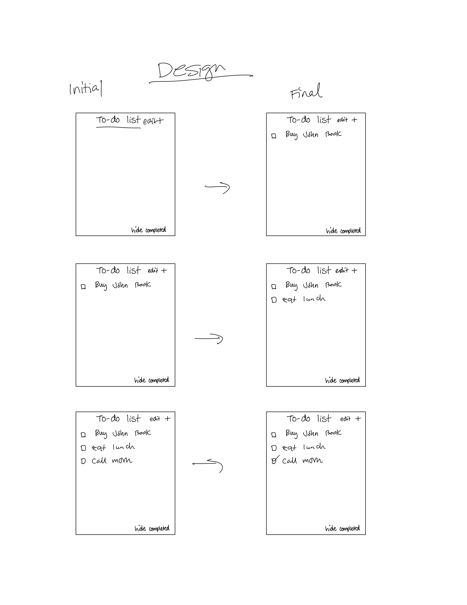
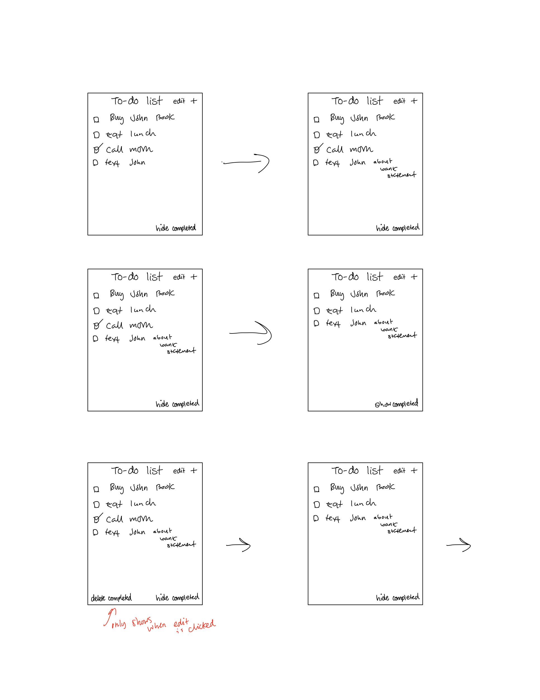

Some design decisions we made that may not be obvious looking at the static pages are that in order to edit the name of an item in the list, you must click the edit button. The button will say done if the to-do list is in edit mode. The users can click this button once they are finished editing the to-do list.

For deleting all completed items, we decided that this can only be done once the to-do list is in edit mode. Once it is in edit mode, a button that says "delete completed" will show at the bottom next to hide completed. Users then can click that button to delete the complete items. 

## Final Design

Our final designs are shown below. The design is in moto G4 size. However, since the other screenshots were taken on a browser, the images are cropped in order to fit the screen. 

### Tasks

- In an empty list, create an item named "Buy new John Grisham book"

#### Initial

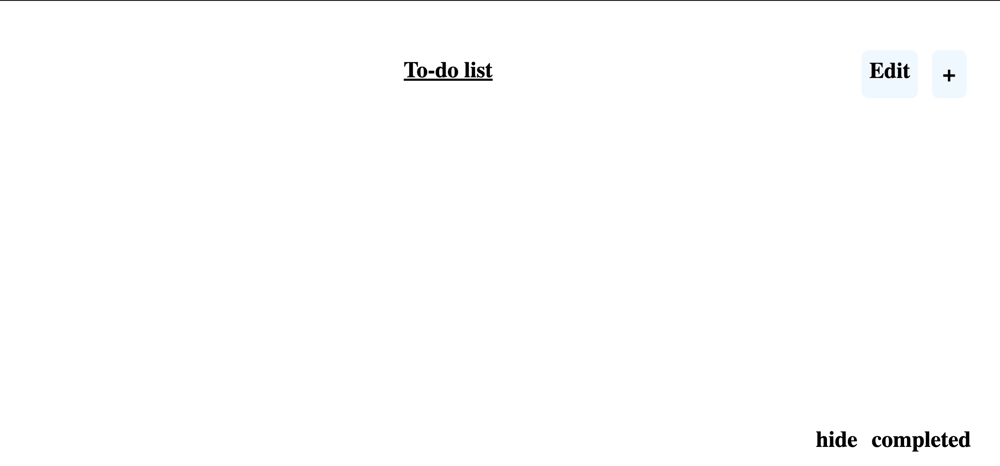

#### Final

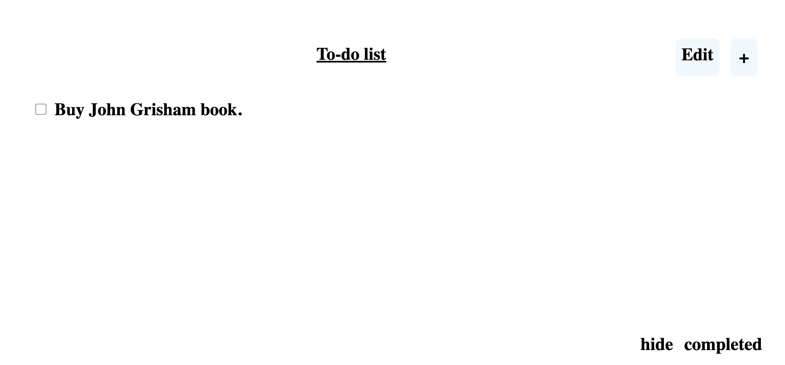

- In a non-empty list, create an item named "Eat Lunch"

#### Initial

#### Final

- Mark the item named "Call Mom" completed (assumes there exists an item named "Call Mom").

#### Initial

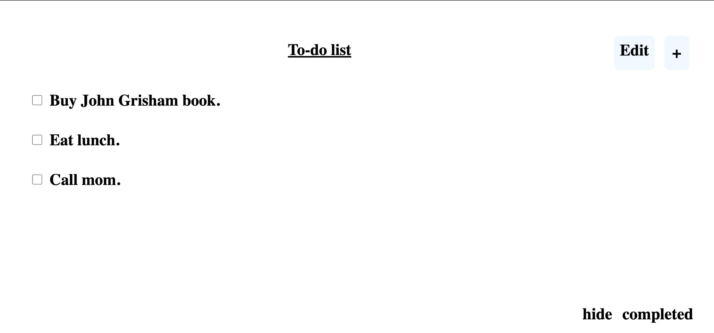

#### Final

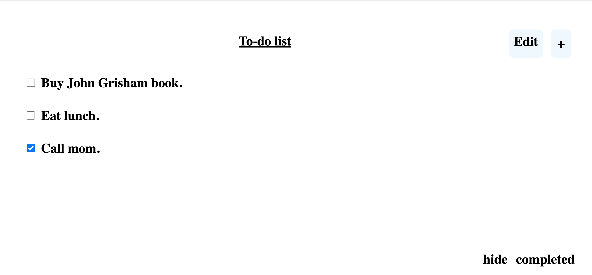

- Rename the item "Text John" to "Text John about bank statements" (assumes there exists an item named "Text John").

#### Initial
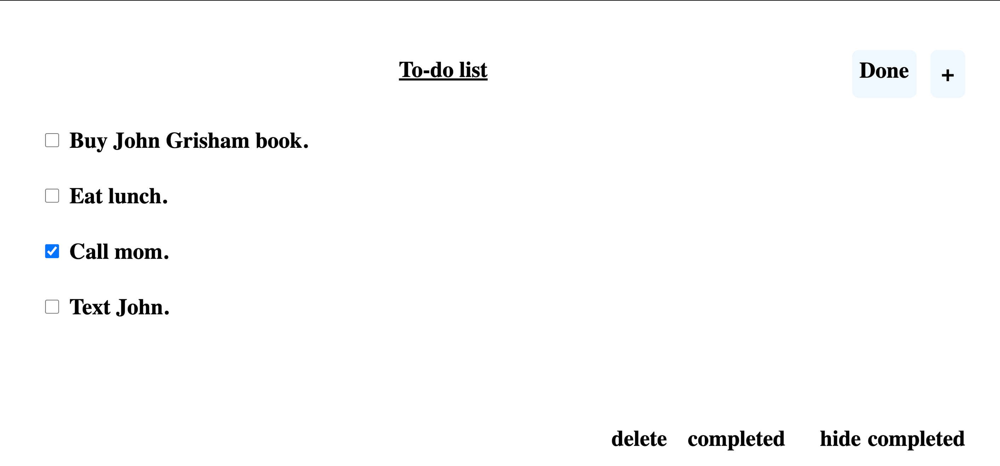

#### Final
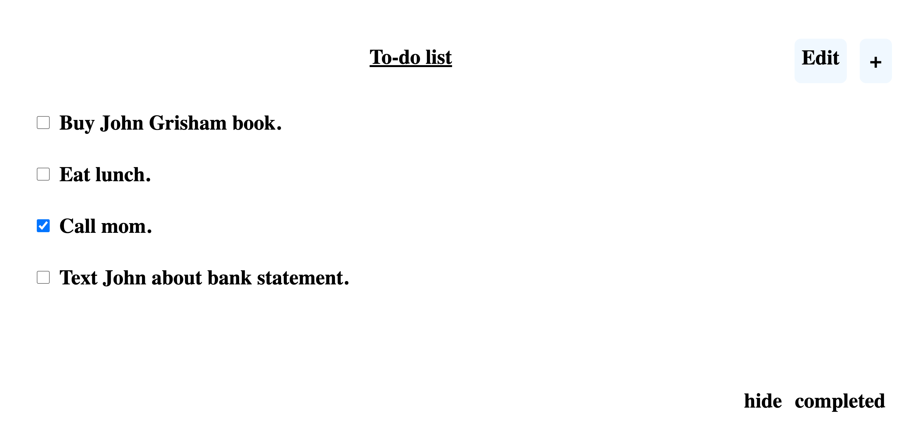

- Show only uncompleted items.

#### Initial

#### Final
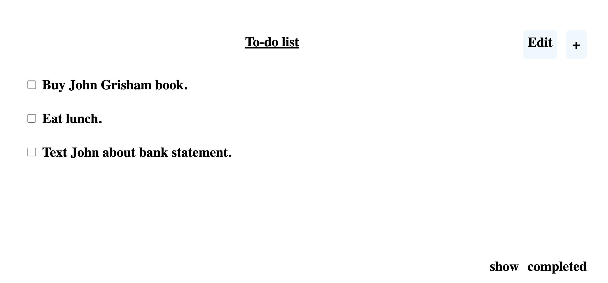

- Delete all completed items.

### Inital
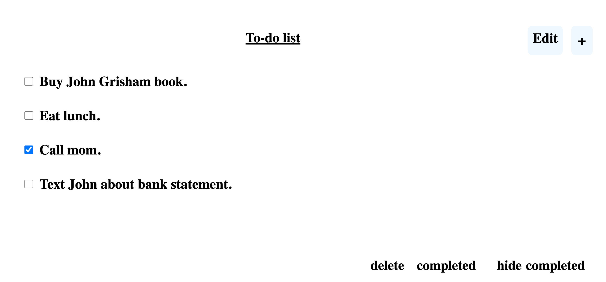

#### Final
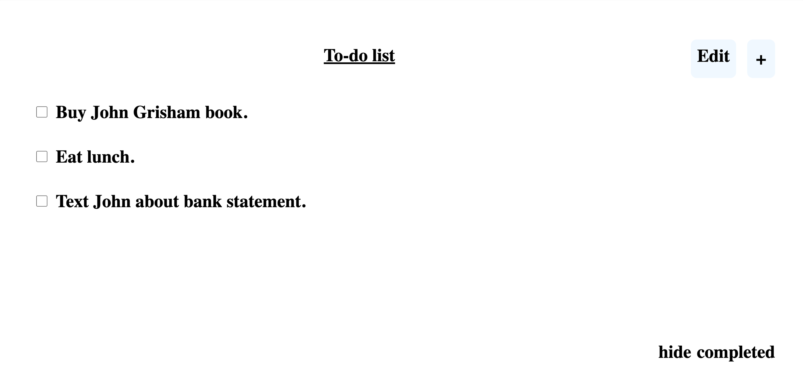
### Challenges

One of the biggest challenges we faced was thinking through the different use cases. Initially, we thought it would be a simple tasks such that each html page clearly showed how the UI worked. However, upon designing it, we assumed the role of the user instead of the developer and realized the number of steps we needed to take in order to do a task. Thus, our biggest hurdle was looking at the user-interface through the perspective of the user.

Another hurdle we encountered was styling. While minor,  we had difficulty with alignment. Especially with the edit and + buttons.

### Successes

However, we were able to finally get the edit and + button to show with proper alignment. Our other successes too is that we were able to follow how we envisioned it to be.