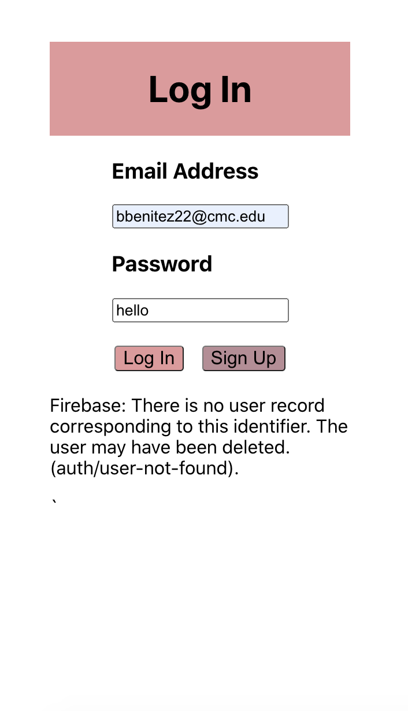

# Lab 5 Design Document

## Design Decisions
### Lab 5 Redesign

For lab 5, we've incorportated a login feature that lets users create an account and have it connected to our firebase dabatase with a set of rules that let a user edit their specific list using their log in account. This meant that we needed to create a new page for the log in page. Our initial and final design choice is shown below:

We decided to keep our design simple and stick to the same color schemes as our to-do list page. This allows for cohesion between the pages and this gives users a visual cue that the login page is connected to the to-do page.

We also had to change the way our to-do list looked like. We had to incorpoorate the users, logging out, and sharing lists. We decided that we will have a header for the todo list. On the top left corner, we will have the user's email (which is also their username). This way there is an indication of who's account is being used for the todo list. We also added a logout button at the top right hand corner. This lets the user log out of their account that has their to do list. Clickling this button brings the users back to the log in page. 

At the footer of our app, we also have the option to let users share their to-do lists with other users with accounts. This option is provided using an input text box with a corresponding button next to the input box, allowing users to add other users to their list. When users share their lists with other users, then those users are also able to edit the original users list. 

Our list of rules for firebase are shown below:

The rules are lax because we were unable to quite figure out how to work with the rules, and moved the restriction logic into the frontend instead. Filtering the data a user can see after pulling all the collection data.
### Alternate Designs

We had very little design alternatives since from the beginning, we were certain about how we wanted to make our design and was like according to users. However, some design options we looked into was creating a modal for logging in:

We wanted to emphasise the login page with a modal. However, we decided it was not feasible since the background would be blank and it would just be easier to make it a new page. Making it a new page also signified a wall that highlights restriction, highlighting how the to-do lists can only be accessed though an account. 

## User Testing

Unlike our previous user testings, our user testing for this round is done in person and with a new user.

### User testing 1

For plus points, our user said that he liked the color scheme and the minimalist design. The user liked how it was simple and straight-forward to log-in. He was also shocked to see that he was able to share his lists with other users. 

He also mentioned that he wished the sharing had rules similar to google docs but we mentioned that it was beyond the scope of the project. He only had minor suggestions such as changing border thicknesses of the buttons but other than that the user was fairly satisfied.

## Final Design

Based on those comments we adjusted it with our final design being

### Landing Page/Login Page

Loggin in without having an account

<!-- Image -->

### Creating an account page.
This is the page when sign up button is pressed.

<!-- IMAGE -->

Attempting to create an account with an invalid email

<!-- IMAGE -->

Attempting to make an account that has a password that is considered weak.

<!-- Image -->

New Login

<!-- Image -->

## Reflection

### Challenges

The most difficult challenge was working with firebase authentication and rules. With just the database, it seemed much more straight-forward. However, authentication stepped up the level of difficulty for us. While it wass difficult to work with, we understand that authentication is important to software development and thus, must be difficult to do. Refactoring the code to accomodate the login page was also challenging since we had to move our code around.

### Successes

Our success is the log-in page and sharing the list. Being able to associate each to-do list with a user, as well as being able to autheticate said user something we were able to achieve. While it was difficult to properly associate each person with each list, we managed to do it for this lab. Furthermore, It was very interesting for us to keep adding more features to current login page. Initially, we had only a few buttons on our to-do list page and it had very little functionality. Now that we have more features, we're glad to see that our original design has (for the most part) stayed the same while still incorportating features to make the to-do more complex.