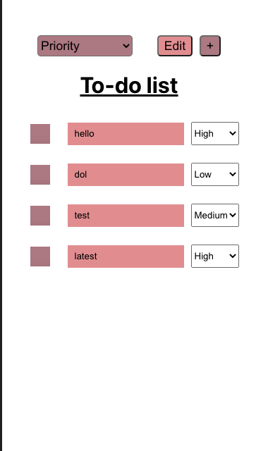
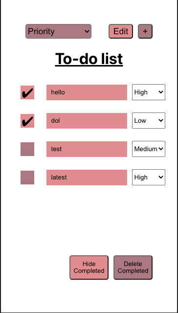

# Lab 4 Design Document

## Design Decisions
### Lab 4 Redesign

- Changed colour slightly to make sure contrast was high enough
- Added aria labels to all buttons
- Add "Sort by" text in front of the sorting options to contextualize the dropdown
- For bigger screens, no need to change the design. For smaller screens, shift the UI components to be organized by columns instead of rows

### Alternate Designs

## User Testing

### User testing 1

As we can see from the texts above, the changes were well recieved. Having them test together and interact with each other also highlighted parts of the app that really stood out.

## Final Design
Note: previous functionality such as editing, deleting, adding todos are in `design-lab2.md` and is excluded from here to avoid repetition.

1. Landing page (with tasks)

2. Landing page (with no tasks)

3. Sorting all todos from the top left dropdown selector

4. Changing the prioirty of a todo from the todo's dropdown selector

5. Adding a new task on default sets it to priority "High"

6. No todos are selected

7. Some todos are selected

## Reflection
### Challenges

### Successes

