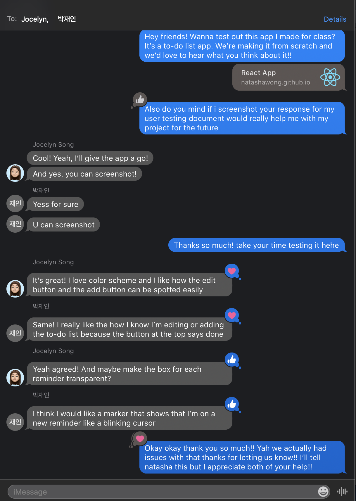
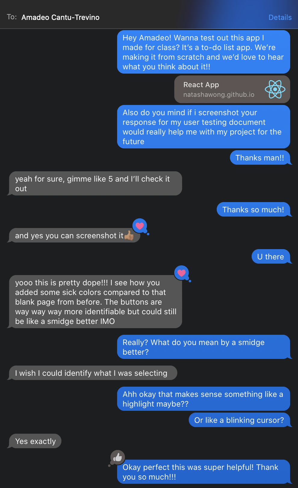
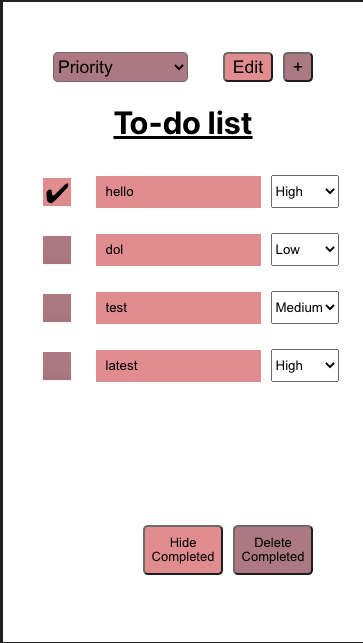
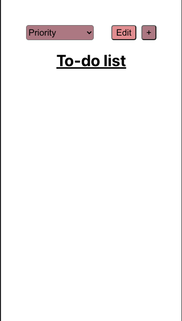
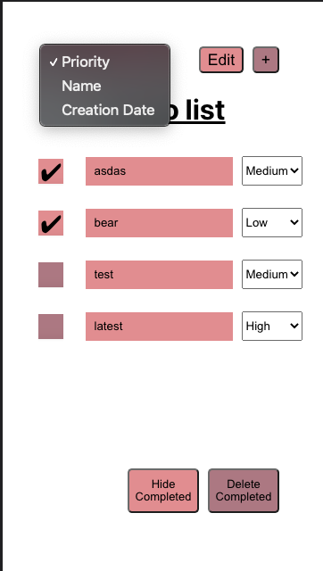
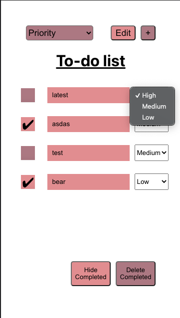
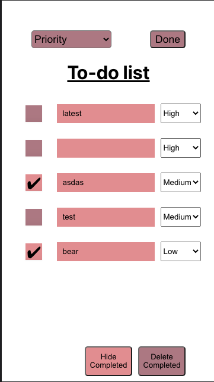

# Lab 3 Design Document

## Design Decisions
### Lab 3 Redesign

For lab 3, we implemented a new priority setting function. This shows up in two places: the top left where a user is able to sort the todos by priority, creation date, or name, and beside each todo where there is a dropdown select providing functionality where a user can set the priority of a todo to "High", "Low", or "Medium".

Improvements from lab 2 include moving the "Hide Complete" and "Delete Completed" buttons out of the "Edit" mode, such that a user can interact with them at any time and minor UI improvements to the todo alignments and checkboxes to give them an appearance more in line with the rest of our fun UI.

### Alternate Designs

When we were considering alternate designs, we thought most about where to allow the user to set the prioirity. Most notably, we considered using a three button approach (having three buttons "High", "Low", and "Medium" with a bolder border or colour difference to indicate which is selected), a slider approach, and our current dropdown approach.

The factors that led to our ultimate decision was what would fit best onto a Motorola G4 screen. Hence, going with the dropdown would best allow for ease of fitting the select information onto the screen. 

## User Testing [TODO: FIX]

We let our users test our inital application in-person. Their comments have been reflected above. After redesigning, re-tested the application with the same people. Since they've already seen the application they already know how the application works. We sent our users our github page for them to test. The screenshots below show their responses to the page.

### User testing 1

### User testing 2

For future labs, we want to test different people. People who have not seen the application before but also the same people who have seen this application to get more feedback. We will want to try to have someone in our class test the our application to get a developers perspective, since developers are also users.

## Final Design
Note: previous functionality such as editing, deleting, adding todos are in `design-lab2.md` and is excluded from here to avoid repetition.

1. Landing page (with tasks)

2. Landing page (with no tasks)

3. Sorting all todos from the top left dropdown selector

4. Changing the prioirty of a todo from the todo's dropdown selector

5. Adding a new task on default sets it to priority "High"

## Reflection
### Challenges

The biggest challenge for this lab was working with hooks and making sure that the state of our app was changing to initiate server side Firebase changes as well. In particular, we struggled with making sure our code followed the Rules-of-Hooks. Our solution to this was learning how to appropriately use state and useEffect to its best capabilities to make sure that our app would update accoridngly.

### Successes

On the success side, we have a pleasant experience working with Firebase. It was not difficult and easy to ramp-up on. Additionally, learning how to read the documentation of this tool was rather intuitive and examples were clear and easy to follow.