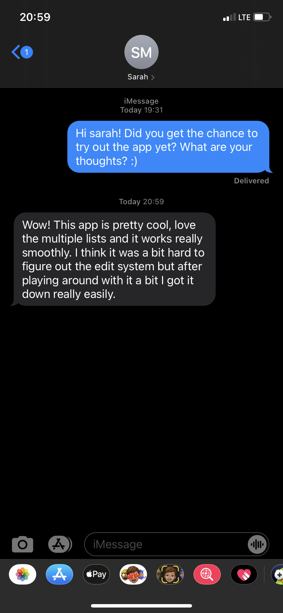
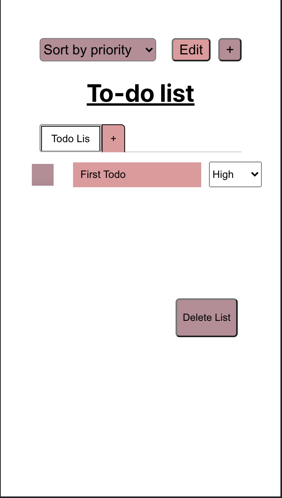
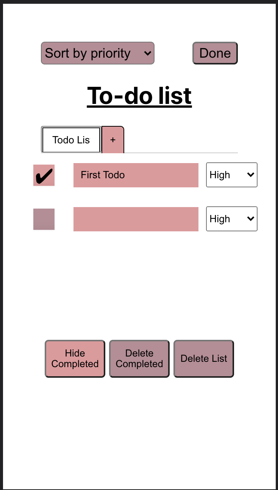
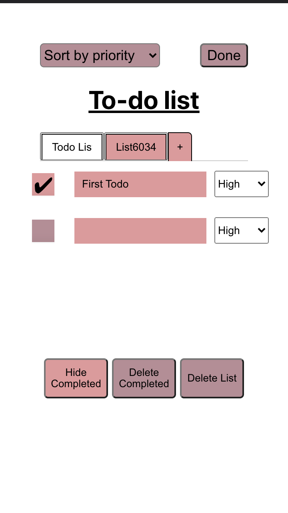
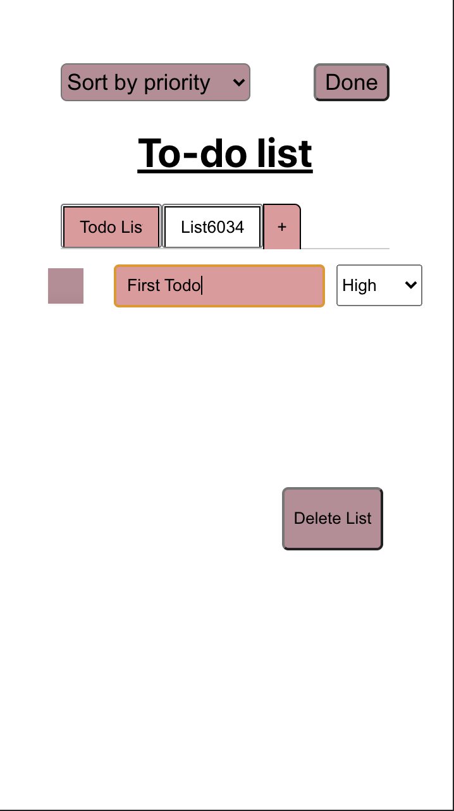
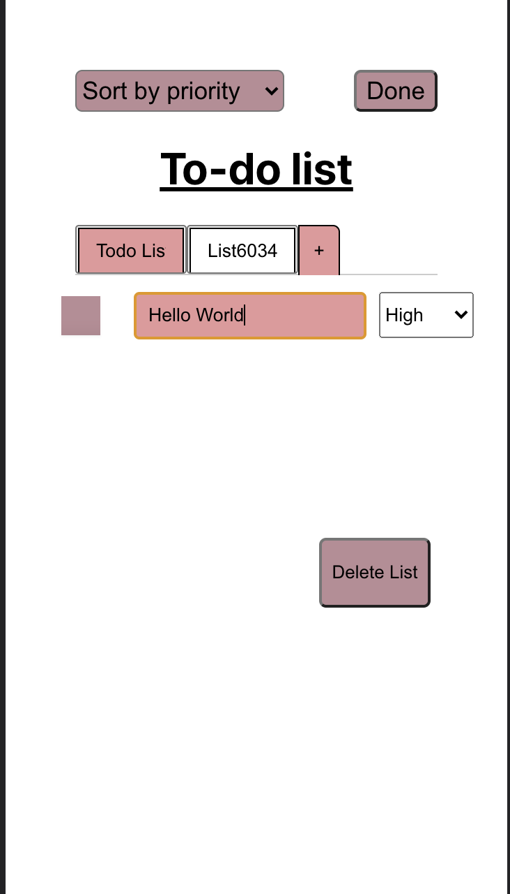
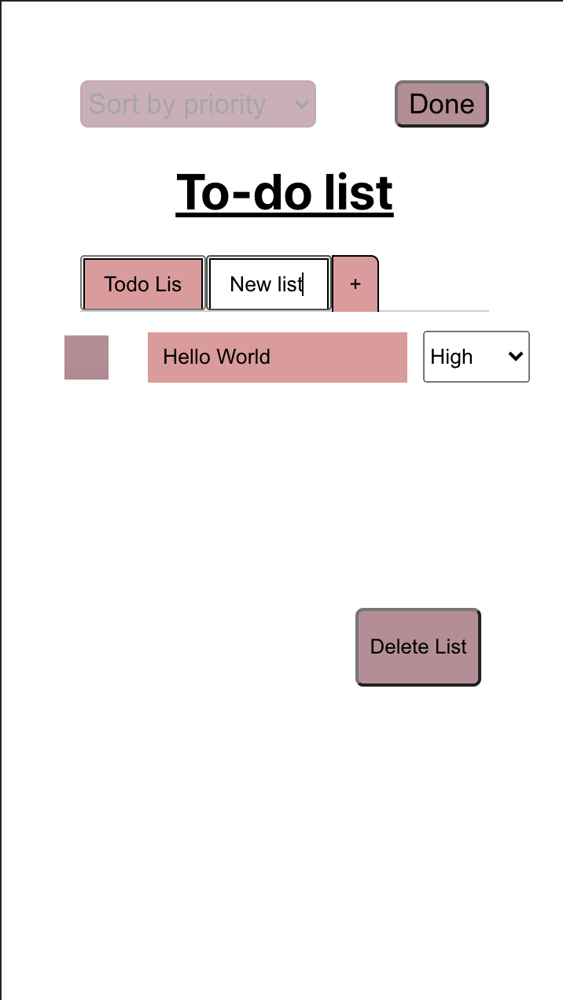
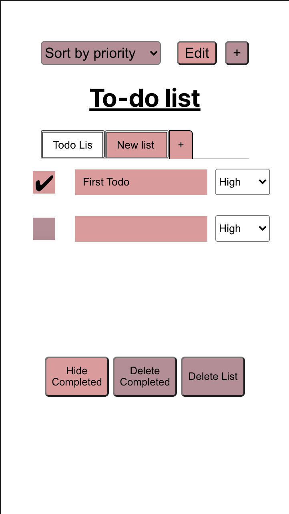

# Lab 4 Design Document

## Design Decisions
### Lab 4 Redesign

For lab 4, our biggest implementation change is creating a tab bar the the top of the lists and underneath the similar to the tabs you see in a notebook. The functionality consists of tabs that you are able to select and it will show the corresponding list. You can add a new list by pressing the plus button at the right end of the tab bar. You can easily delete a list since there is a convenient button at the bottom of the page that allows you to do so. Furthermore, you can edit the list names by clicking the edit button (similar to editing a todo).

We've also increased accesibility by adding aria labels to the components of the page. By doing this, people who require visual accesssibility may use VoiceOver applications to aid in naviagating through the page. We maded sure to keep the names of these components as simple as possible.

From the backend perspective, we decided with a data structure that puts all the todos into one collection with each todo having a corrspoding list title to indicate which list it is from.

We decided to stick to the same color scheme as the rest of our application and a tab is highlighted when the tab is white while it is pink if it is not active.

### Alternate Designs

When posed with the idea of multiple list, we explroed the idea of using dropdown menus or using more buttons to indicate different lists. We settled with tabs since we wanted the to-do list to feel close to a notebook topic separator. We also decided that it would be best to place then at the top of the page instead of the bottom (something like excel sheets) because we knew that it would be most useful for users to see what list their are looking at at the top of the page (like a bookmark from a physical book). 

Furthermore, we looked into the different ways we can edit these tabs. One alternate design was to use a modal to create new lists. We wanted the users to put in all the information about the list before making a new tab but we decided to keep it simple and just like creating a new sheet in excel.

Another data structure we decided on was having a collection for every new list. This was we have one collection that stored all the tabs and the names of the collection for each tab but opted to store everything in one collection. 

## User Testing

We decided to get input from other sources and asked a new person to test our app. We realised that the "edit" functionality is still a little confusing to users, and will work on it in our next iteration.

## Final Design
Note: previous functionality such as editing, deleting, adding todos are in `design-lab2.md` and `design-lab3.md`. To prevent repetition, we decided to only feature creating new tabs.

1. Landing page (with tasks and one tab)

2. Landing page (with multiple tasks)

3. Adding a new tab by clicking the + button

4. Landing page of the new tab

5. Editing the new todo

6. Editing the new tab label

7. Clicking on the another tab after creating a new tab

## Reflection
### Challenges

One of the biggest challenges for this lab was to figure out what type of data structure to use to create the tab list. While we got it to work in the end, there were many problems that arised making different collections.

Furthermore getting the tabs to work alongside firebase was tricky at first but once we decided no our data structure it was easy to distinguish

### Successes

Our successes was implementing multiple lists. While we had problems refactoring at the start, the process was easy and it was nice how we were lead into creating multiple lists from the classes. Furthermore, creating a new design each time was fun to do especially figuring out ways to incorporate the new task.