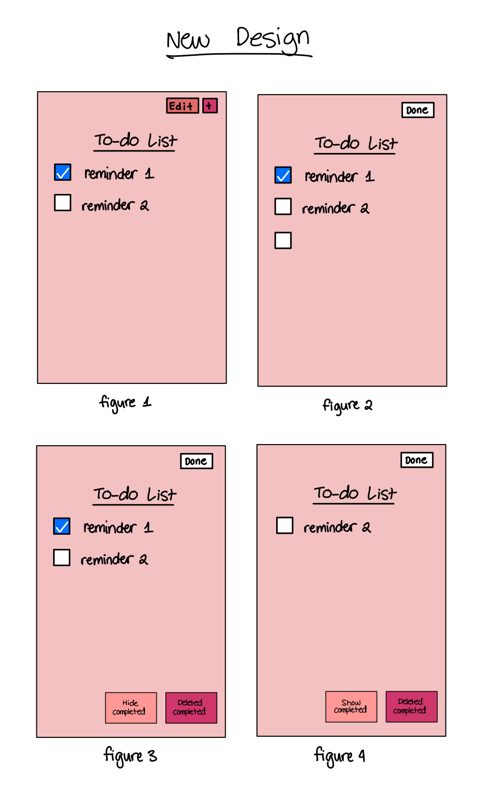

ur design decisions, including their rationale (include images)
alternative designs you considered, including images
any user testing you did
the final design, including screen images and the flow for each task.
challenges you faced
parts of the design you're most proud of

# Lab 2 Design Document

## Design Decisions

### Inital Design

Here are our initial designs from lab 1. 

Since the list of things we were given from the lab seemed like a list of things to do. We decided to call the title of the page a to-do list. By using the 80/20 rule, we decided that we just wanted to show the check list items and have the other options be hidden and only be accessed by clicking the "edit" and "+" button. The "+" button refers to adding a new item to the list. We also decided to place the hide completed at the bottom of the page since while something people use, it is not as important as being able to edit the to-do list or adding new item to the list.

Some design decisions we made that may not be obvious looking at the static pages are that in order to edit the name of an item in the list, you must click the edit button. The button will say done if the to-do list is in edit mode. The users can click this button once they are finished editing the to-do list.

For deleting all completed items, we decided that this can only be done once the to-do list is in edit mode. Once it is in edit mode, a button that says "delete completed" will show at the bottom next to hide completed. Users then can click that button to delete the complete items. 

### Redesign

After lab 1, we decided to redesign 

### Alternate Designs

## User Testing

## Final Design

### Challenges

### Successes
