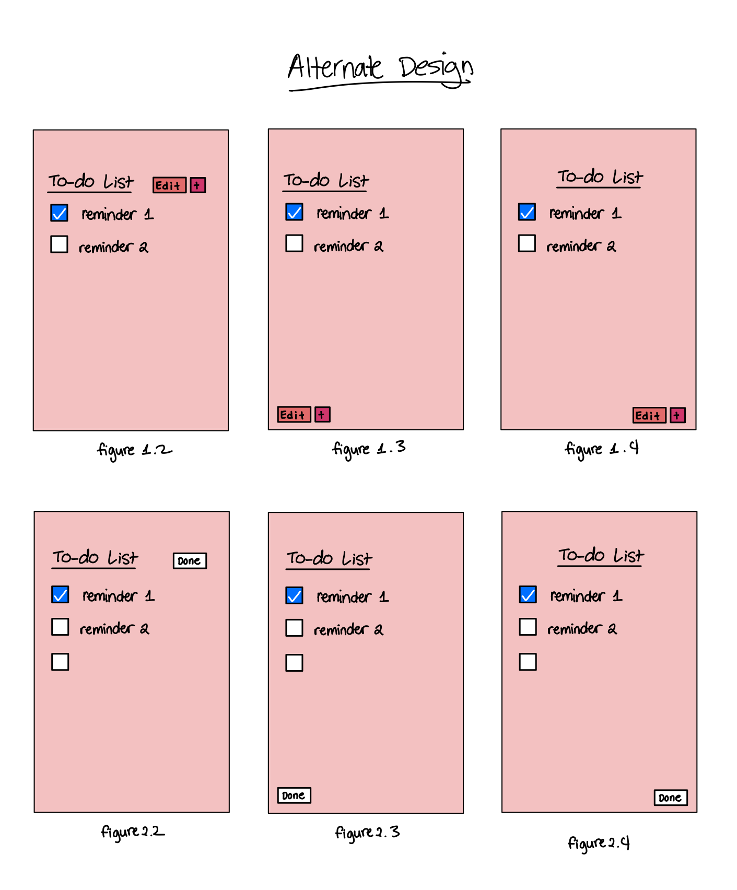

# Lab 2 Design Document

## Design Decisions

### Inital Design

Here are our initial designs from lab 1. 

Since the list of things we were given from the lab seemed like a list of things to do. We decided to call the title of the page a to-do list. By using the 80/20 rule, we decided that we just wanted to show the check list items and have the other options be hidden and only be accessed by clicking the "edit" and "+" button. The "+" button refers to adding a new item to the list. We also decided to place the hide completed at the bottom of the page since while something people use, it is not as important as being able to edit the to-do list or adding new item to the list.

Some design decisions we made that may not be obvious looking at the static pages are that in order to edit the name of an item in the list, you must click the edit button. The button will say done if the to-do list is in edit mode. The users can click this button once they are finished editing the to-do list.

For deleting all completed items, we decided that this can only be done once the to-do list is in edit mode. Once it is in edit mode, a button that says "delete completed" will show at the bottom next to hide completed. Users then can click that button to delete the complete items. 

### Redesign

After lab 1, we began planning to convert our static HTML page to a javascript page. In doing so, we thought of re designing our application to better incorporate the javascript actions. We also thought our original design did not look as aesthetically appealing. Thus, we created new designs.

While the designs is very similar to our original design, there are some changes that are made. See below.

One major design change we implemented is the css color styling. When we initially showed our users our html pages to see how we can improve from lab 1 and their intial reactions were that they wanted to see more color that signified the buttons since our footer buttons were not obvious in our html pages. Since it was a static page, that was their only real concern at the time. Hence, we changed our design to incorporate colored and bordered buttons (figure 3 and figure 4). Additionally, we initially wanted to go for a more minimalist application with having a white background. But we decided that was a little boring. Thus, we added a background color to the application. We settled with a monochromatic theme: surrounding red. We thought having too many colors may be overwhelming for a simple app. Additionally we thought a monochromatic look is  more aesthetically pleasing. We adapted our color scheme from [coolors.co](https://coolors.co/ffcdb2-ffb4a2-e5989b-b5838d-6d6875) and mixed colors based on that. 

Additional changes were made to the buttons. First, the footer buttons don't show up unless they are in edit mode (figure 3). Therefore, when users click the + button, they do not have the option to edit or show other to-do items (figure 2); these other items are then read-only. Figure 4 depicts how the page would look like assuming someone clicked the hide completed button. This will prompt the button to change and say "show compeleted" instead. We also decided to add the top buttons as part of the header instead of in-line with the title.

Not reflected on the images is that we want to be able to indicate that when you click the + button, you are able to edit the new reminder. We will do this by have an autofocus component on the new element. This unfortunately did not make it to the actual implementation as we struggled to get it to work.

### Alternate Designs

When we redesigned. We thought about moving the buttons around to see if they would work better in other positions of the page. See below.

For figures n.2 and n.4 (where n is 1, 2, 3), we thought that the buttons did not fit well with the alignment of the application. Figures n.2, this was our orignal design but with the colors implemented. For the reasons mentioned above, we decided to not choose this design. For figures n.4, we thought that having the editing buttons at the header looked odd and unnatural. Especially since it only appears when on edit mode. Therefore, we decided to leave it at the footer. While we thought that figure 1.3, 2.3, 3.3 looked great as a design drawing, it did not look as good implemented. We also thought it might be too crowded to have all the buttons at the buttom of the page and difficult to find the two important buttons, which are the edit and add buttons. 

## User Testing

### User testing 1

### User testing 2

## Final Design

When you land on our page, it will look like this. We added two items just to give examples of the list.

However, if there are no items, the list would look like this. 

When we click the + button, our app looks like

In editing mode, the app will look like

Let's add "submit lab 2" as a to-do element by clicking the add button and adding lab 2

then let's leave adding mode.

Oh no we meant lab 2 not lab 1. Let's go edit that now using the edit button

That's better. We don't need to edit anymore this is perfect.  Well, we've already called mom and eaten lunch, so we will check those boxes.

Now, we don't need these reminders anymore right now. Let's hide that first using the hide completed button, which is in the editing mode

Wait, did we hide it? Is it still there? Let's see if it's all here. Let's click show all and click done

Okay. We don't actually need it anymore so let's delete that using the delete completed button.

That's better. We're done editing. We just need to submit our lab so we can click the done button.

## Reflection
### Challenges

Our biggest challenge for this lab was that we were unable to add the autofocus feature that highlights the new element when it is in adding mode. We tried several different methods to add the autofocus. However, because of the way we designed our application, the app doesn't highlight upon clicking the button, instead it will automatically highlight when loading the page (useEffect was our best option). However, this is not what we wanted. Thus, we decided to adandon that design element for now.

Furthermore, since we added a background color, the input form had a white background and we struggled changing this. However, since we were not able to implement autofocus, we decided to keep the box for now to help indicate that there is new to-do list is being made when in adding mode.

### Successes

On the success side, we were proud of the fact that we had gotten the edit and add buttons to work cleanly. We think the particular touch where we automatically remove a Todo if it has no text in it works smoothly. Further, we struggled a fair bit with getting the various states to match up and work well with each other when the user is changing the text, checkboxes, and adjusting whether they are in editing, base, or adding mode. We thought deeply about each state and what is necesary and not necessary for the user: for example, during editing we allow for the text to change but not for the checkboxes to prevent errors to occur as the "delete completed" button is now available to be clicked. Additionally, we also make it so the Todos are in a readonly and non-editable state when not in the edit state to prevent users accidentally changing the todo. If a user were to be in the adding state, only the last and new todo is editable while the rest are not as well. We believe that putting thought into these small actions helps create a significantly better user experience. 